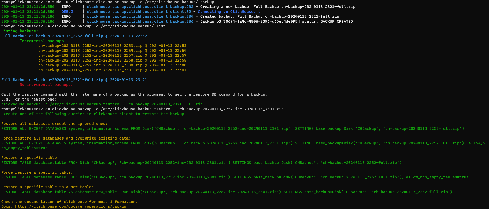

# clickhouse-backup

[](https://gitlab.com/Hedius/clickhouse-backup/-/commits/main)

A backup tool for ClickHouse which uses the native
[BACKUP](https://clickhouse.com/docs/en/manage/backups)
command to create backups and to restore from them.

Meant for single-node setups. Not tested with clusters.



## Features

* Support for file, disk and S3 storage backends.
* Creates full and incremental backups. You can specify the number of incremental backups to keep.
* Automatically removes old backups.

File and disk operations are fully supported. S3 is not tested at the moment.

## Installation

A debian package is provided for each release.
You can download them from the release page and from the project's
[GitLab CI](https://gitlab.com/Hedius/clickhouse-backup/-/packages).

The package is built for Debian 12 (bookworm). It should work on other Debian-based distributions as well.
A recent clickhouse-server is required on the same machine. Using the official ClickHouse repository is recommended.

The configuration is stored in `/etc/clickhouse-backup`.
The default configuration (`default.toml`) is:

```toml
# Overwrite settings / or add custom settings in settings.toml
# in the same folder!
[clickhouse]
user = 'default'
passsword = ''

[logging]
dir = '/var/log/clickhouse-backup'

[backup]
target = 'Disk'
dir = '/var/backups/clickhouse'
disk = 'CHBackup'

# 1 full backup per week by default / on every 7th run
# 0 = full backup on every run.
# a full backup will be created every time a chain has reached x incremental backups.
max_incremental_backups = 6
# keep 2 full backups by default + their incrementals
# set to 0 to keep all backups
max_full_backups = 2
```

You can add a `config.toml` to the same folder to overwrite the default settings.

A systemd timer `clickhouse-backup.timer` is provided to create backups automatically.
The timer runs every night at 02:00 am.

You can use the program with the command:

```sh
# /etc/clickhouse-backup as the config folder
sudo -u clickhouse clickhouse-backup
# or with a custom config folder
sudo -u clickhouse clickhouse-backup -c YOUR_CONFIG_FOLDER
```
Consider running at as the user clickhouse since the timer also runs with that user.

Check the makefile for different options. (E.g. building a python package)

## Configuration

Configuration can be performed over configuration files and environment variables.
The config folder is `/etc/clickhouse-backup` by default
and can be adjusted over the '-c' parameter.
The default config is automatically saved to `default.toml` in the config folder.
You may edit this file or create a `config.toml` in the same folder to overwrite the default settings.

All settings can be overwritten by environment variables.
The environment variables have to be prefixed with `CHBACKUP_`.
The format for setting settings is `CHBACKUP_<SECTION>__<SETTING>`.
For more information see the [dyanconf docs](https://www.dynaconf.com/).

### Options
```toml
[clickhouse]
host = 'localhost'
port = 9000
user = 'default'
password = ''

[logging]
# logs the output of the clickhouse-backup command to the given directory.
# not set / disabled by default.
dir = ''

[backup]
# the target to use for the backup: File, Disk or S3
target = 'Disk'
# the directory to store the backups in. Used for File and Disk targets to check
# for existing backups and to delete old backups.
# Not set by default. MUST BE SET! (except for S3)
dir = ''

# The disk for the Disk target.
# Not set by default. MUST BE SET! (except for File and S3)
disk = ''

# databases to ignore in the backup.
ignored_databases = [
    'system',
    'information_schema'
]

# 1 full backup per week by default / on every 7th run
# 0 = full backup on every run.
# a full backup will be created every time a chain has reached x incremental backups.
max_incremental_backups = 6
# keep 2 full backups by default + their incrementals
# set to 0 to keep all backups
max_full_backups = 2

[backup.s3]
# s3 config for the S3 target.
endpoint = ''
access_key_id = ''
secret_access_key = ''
```

## Usage / Operations

```
Usage: clickhouse-backup [OPTIONS] COMMAND [ARGS]...

  Create and restore ClickHouse backups. Help and documentation are available
  at https://github.com/Hedius/clickhouse-backup.

Options:
  -c, --config-folder TEXT  Folder where the config files are stored.
                            /etc/clickhouse-backup by default. Make sure that
                            the user has read and write access to the folder.
  --version                 Show the version and exit.
  --help                    Show this message and exit.

Commands:
  backup   Perform a backup.
  list     List all existing backups.
  restore  Generate the restore command for the given backup.
```

### Create a backup

```
Usage: clickhouse-backup backup [OPTIONS]

  Perform a backup. Depending on the settings, this will create a full or
  incremental backup.

Options:
  -f, --force-full  Force a full backup and ignore the rules for creating
                    incremental backups.
  --help            Show this message and exit.
```

### List existing backups

```
Usage: clickhouse-backup list [OPTIONS]

  List all existing backups. :param ctx: click context :return:

Options:
  --help  Show this message and exit.
```

### Restore from a backup

```
Usage: clickhouse-backup restore [OPTIONS]

  Generate the restore command for the given backup. Use the command in
  clickhouse-client to restore the backup. You can use the output of the list
  command to view available backups.

Options:
  -f, --file TEXT  The file to restore. Name has to fully match!  [required]
  --help           Show this message and exit.
```

## License

The project is licensed under the GPLv3.